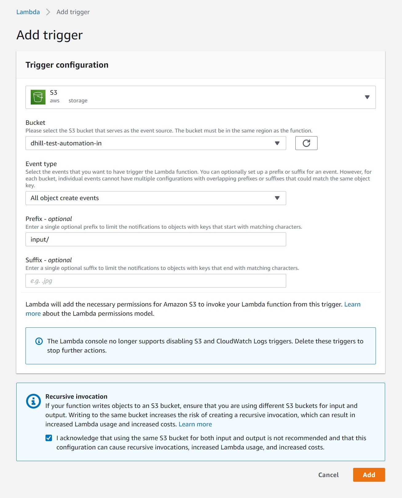

# A Test Automation Assignment for Interviews

## Introduction

This is intended to be comparable to many of the technical assessments seen for software developer interviews, which has become popular to get an understanding of a candidate's ability in a more realistic work setting. While it is relatively common for there to be exercises purely on software development capabilities, with a wide range of tools offering this, there are far less options available when looking for a comprehensive look at how Test Automation Engineers would operate in a typical work scenario. This exercise was built as a way to deliver an application to potential candidates to design, implement and test their own test framework against. 

## Overview

This is intended to be a very simple file processing pipeline where csv files dropped to an S3 bucket trigger a lambda function and deposit the processed data in a json file in another S3 bucket. The code for the lambda function is written in Python 3 and deliberately done very simply to encourage the candidates to find issues and offer suggestions to improve it. 

The conversion of csv data to a nested JSON object is also a deliberate choice to add an additional layer of complexity, forcing candidates who want to programmatically parse both the input and the output to have to deal with two different formats. 

## Input file

The input file is expected to be .csv and should have the following fields:

| Field | Rules | Example|
| ----- | ----- | -----  |
| ID    | Must be numeric and under 10 characters | 46843 |
| Product | Must be between 2 and 256 characters | PS5 |
| Vendor | Must be between 2 and 256 characters | Sony | 
| Transaction Date | Needs to be this format - YYYY-MM-DDTHH:MM:SS | 2021-01-31T19:23:44|
| Transaction Price | Will only accept numbers with and without a decimal point | 499.99 |
| Transaction Status | Will only accept "Paid", "Unpaid" or "Processing" | PAID |
| VAT Number | Will accept EU VAT numbers or "N/A" | IE3235723A |
| Customer | Must be between 2 and 256 characters | Dave Hill |


The files will only be processed if they have all these fields and no additional ones. Again, the check here is deliberately simplistic for Assessment purposes. An example input file is below:

```
13513,PS5,Sony,2009-01-21T16:21:32,499.99,PAID,N/A,Dave Hill
412431,Xbox,Microsoft,2021-01-21T12:59:11,449.99,UNPAID,IE2132763A,Mick Murphy
```

## Output file

If any of these fields are missing or break one of the rules, then when the record is processed with the lambda function, an error will occur. For breaches of the file format itself, i.e. empty files or unable to read them, the file itself will be dropped in an "ERROR" folder in the output bucket with the Error code appended to it and the error message within the file. The file name will take the format of `timestamp-error_code`, i.e. `2021-01-31-02_27_11-F2` with the file containing:
```
File is empty
```

If the file is correctly formed but the record has a field that breaches a rule, the file will be processed but the record its trying to parse will only output an Error Code and Error Message in the JSON object for that line. Otherwise a successful record will be converted to JSON. An example of both can be seen below:
```JSON
{
    "Records": [
        {
            "Record": {
                "ID": "13513",
                "Product": "PS5",
                "Vendor": "Sony",
                "Transaction": {
                    "Date": "2021-01-31T19:23:44",
                    "Price": "499.99",
                    "Status": "PAID",
                    "VAT Number": "N/A"
                },
                "Customer": "Dave Hill"
            }
        },
        {
            "Error": {
                "ErrorCode": "E8",
                "ErrorMessage": "VAT number should be in format IE12345678A or N/A"
            }
        }
    ]
}
```

## Setup

To set this up, you'll need an AWS account that has the permissions to set up a pair of S3 buckets and a Lambda function. Set up the Lambda function to use Python 3 (3.8 at the time of writing) and then go to the configuration section and copy the python code in this repo into the function code section and hit the Deploy button. 

The code references the "OUTPUT_BUCKET" via an environmental variable which you can set on this page also. This will determine where your processed files end up, and an "ERROR" and "PROCESSED" folder in this bucket will be created as files are processed. 

To setup the trigger action of processing files as they are uploaded to the input bucket, click "Add Trigger" on the Designer and set up the trigger as below 



Once this is done, it should be sufficient to get started with. In order to allow candidates to use this application, there are a number of options on how much access you want to give them. If its a sandbox AWS account, you may be happy to just hand over logins but a much more robust and secure approach is to lock down access just to the S3 buckets in use for this exercise, either through dedicated AWS keys or IAM user. This should be perfectly sufficient to allow the candidates to submit files, verify environments or pull down results from the processing. 

## Support

Feel free to raise an issue if you have issues with this code or installation, happy to take feedback or answer questions. 